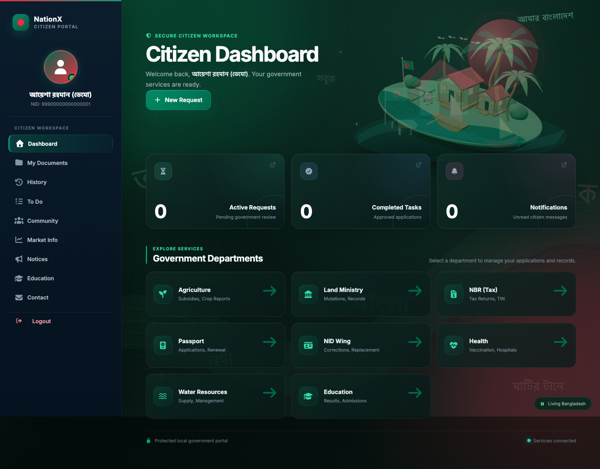
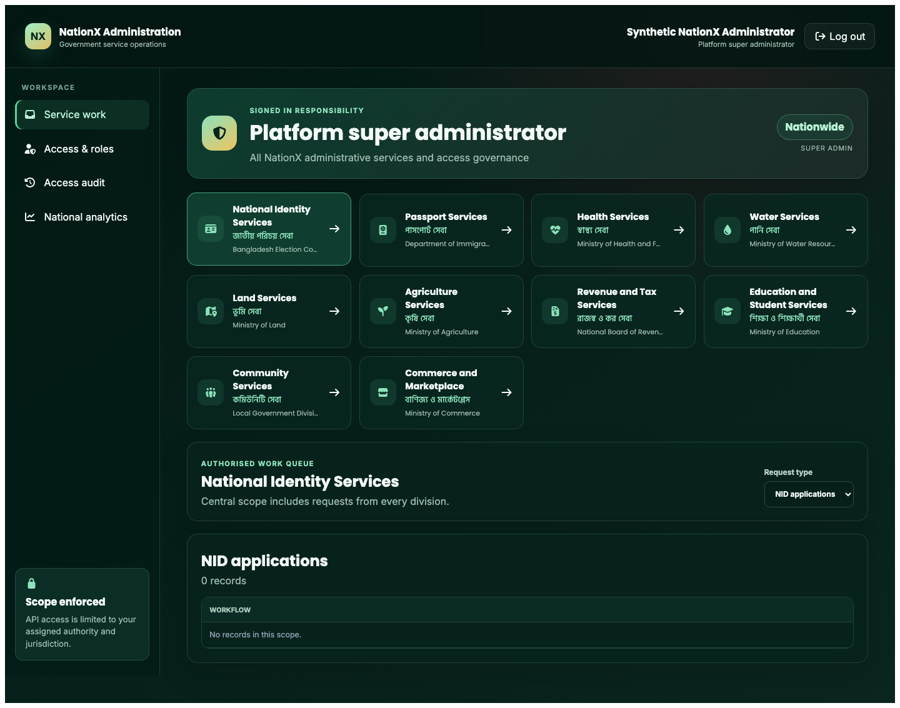

<div align="center">

# 🇧🇩 NationX

### Bangladesh, Connected.

**A unified digital portal for citizen services, government administration, and public information.**


[Features](#features) · [Architecture](#architecture) · [Quick start](#quick-start) · [Testing](#testing) · [Project report](#full-project-report) · [Limitations](#demonstration-scope-and-limitations)

</div>

---

## About NationX

NationX is a full-stack academic software-engineering and DBMS project inspired by Bangladesh's digital public-service ecosystem. It combines citizen identity, health, education, land, agriculture, water, tax, community, shopping, admissions, and administrative workflows in one application.

The active frontend is **React + Vite** and preserves the original `.html` URL contracts. The backend remains **Node.js + Express**, and application data is stored in a substantial **MySQL/MariaDB** schema containing domain tables, views, triggers, and a stored-procedure catalogue. The original frontend under `public/` remains available as a rollback reference.

> **Academic demonstration:** NationX is not an official Bangladesh government service. It must not be deployed publicly or used with real citizen information.

<p align="center">
  
</p>

## Current project snapshot

The repository-level technical assessment and the current automated suites establish the following scale. Source declaration counts include overlapping schemas and must not be confused with unique installed database objects.

| Area | Current evidence |
|---|---|
| Frontend | 29 routed React experiences with legacy `.html` addresses preserved |
| API | More than 400 Express route handlers across citizen, applicant, service, assistant, and admin modules |
| SQL source | 176 `CREATE TABLE` occurrences across schemas, migrations, and seeds |
| Inspected development DB | 156 base tables, 17 views, and 16 triggers at the report snapshot |
| Frontend verification | 26 Vitest files and 159 passing tests |
| Browser verification | 68 Playwright tests registered across 8 browser files |
| Judge workflow | 167 checks: 159 component/contract tests plus 8 visual-quality browser tests |
| Medicine data | 57,799 source records normalized into 53,987 canonical medicine records |

The full report is a point-in-time assessment dated **1 October 2026**. Test totals above reflect the newer working tree verified on **4 October 2026**.

## Features

### Citizen portal

- Citizen registration, login, password recovery, profile, and document vault
- Unified dashboard, notifications, service history, and to-do management
- NID applications, corrections, reissue, appointments, and tracking
- Passport application, document submission, fees, offices, and tracking
- Health cards, vaccination records, appointments, ambulance requests, and medicine identification
- Water connections, billing, complaints, and quality reports
- TIN, returns, VAT, challans, tax notices, and payments
- Land records, mutation applications, ownership transfer, and land-tax demonstration
- Agricultural crop reports, subsidies, marketplace, training, and expert questions
- Education results, stipends, university admissions, and applications
- Community groups, posts, comments, reactions, notices, contact, market, and store

### Administration

- Separate JWT-based administrator authentication
- Domain dashboards for NID, passport, health, and water
- Scoped approval and rejection workflows
- Cross-domain reports, status filtering, pagination, notifications, and audit records
- Trigger-authoritative land ownership transfer with transactional approval behavior

### Presentation and accessibility

- Bangladesh-inspired animated landing, authentication, loading, dashboard, and ministry experiences
- Distinct rural Bangladesh backgrounds for NID, passport, health, and education
- Bilingual English/Bangla service navigation and culturally consistent visual identity
- Responsive layouts tested at desktop and phone widths
- Keyboard-operable mobile navigation, reduced-motion handling, and 44-pixel touch targets
- Compact voice-assistant launcher that does not obscure forms or service cards

### Database coursework

- Large normalized multi-domain relational schema
- Versioned installation and compatibility migrations
- Synthetic demonstration identities and clearly marked demo geography
- Views, analytical queries, triggers, audit logging, and stored-routine definitions
- Isolated `central_govt_db_test` regression baseline

## Architecture

```text
React 19 + React Router + Vite
              │
              │ same-origin JSON / multipart requests
              ▼
Node.js + Express 5 REST API
              │
      JWT citizen/admin guards
      validation · uploads · transactions
              │
              ▼
MySQL/MariaDB
tables · views · triggers · procedures · audit
```

The React application never accesses the database directly. It calls relative `/api/*` endpoints, while Express owns authentication, authorization, input validation, record ownership, transactions, uploads, and SQL execution.

## Technology

| Layer | Technology |
|---|---|
| Frontend | React 19, React Router, Vite, SweetAlert2, Font Awesome, Three.js |
| Backend | Node.js, Express 5, CommonJS REST routes |
| Database | MySQL/MariaDB through `mysql2/promise` |
| Authentication | JWT and bcrypt/bcryptjs |
| Uploads | Multer with local demo storage |
| Payments | SSLCommerz sandbox plus clearly labeled local simulation |
| External data | Open-Meteo, NASA POWER, optional medicine-identification provider |
| Testing | Node test runner, Vitest, Testing Library, Playwright, Python unittest |

The repository contains configurable Gemini and Groq integration boundaries. The private local-model and n8n deployment described in the technical report is team-supplied deployment architecture; model weights, training notebooks, evaluation datasets, and n8n workflow exports are not included in this repository snapshot.

## Project structure

```text
Software_Engineering_Project/
├── client/                       # React + Vite application
│   ├── src/
│   │   ├── components/           # Shared dialogs, loaders, demo payment panel
│   │   ├── context/              # Authentication state
│   │   ├── features/             # Citizen, service, admission, and admin pages
│   │   ├── layouts/              # Citizen and authentication shells
│   │   ├── services/             # Shared API client
│   │   └── styles/               # React design system
│   └── vite.config.js
├── public/                       # Original HTML/CSS/JS and rollback frontend
├── src/
│   ├── app.js                    # Express entry point and frontend cutover
│   ├── config/                   # Database pool
│   ├── controllers/              # Authentication, dashboard, and user logic
│   ├── middleware/               # Citizen/admin JWT and upload middleware
│   ├── routes/                   # Domain REST APIs
│   ├── services/                 # Medicine-identification services
│   └── database/                 # Schemas, migrations, seeds, triggers, views
├── scripts/                      # Database and medicine-data utilities
├── dataset/                      # Medicine reference datasets
├── test/                         # API, database, browser, and pipeline tests
├── reports/nationx-full-project-report/
│   ├── report.pdf                # Full repository analysis
│   ├── report.tex                # Reproducible LaTeX source
│   └── assets/                   # Synthetic-data screenshots and ER overview
├── TESTING_SHOWCASE.md           # Judge-ready testing guide
├── start.sh                      # Local React/Express launcher
└── package.json
```

## Requirements

- macOS or Linux shell environment
- Node.js 20 or newer and npm
- MySQL or MariaDB running locally
- A local `.env` created from `.env.example`
- The initialized `central_govt_db` database

Do not commit `.env`, passwords, tokens, API keys, uploaded identity files, or real citizen data.

## Quick start

### 1. Install dependencies

```bash
npm install
npm run client:install
```

### 2. Configure the local environment

```bash
cp .env.example .env
```

Edit `.env` locally with your MySQL connection and a strong local JWT secret. Never place database credentials in the React client or any `VITE_*` variable.

When cloud-assisted features are enabled, Gemini handles constrained intent checking and medicine-image transcription. A Groq-hosted text model can be configured as a fallback for assistant intent and additional catalogue research; it does not read medicine images. The provider circuit changes over only after repeated eligible transient failures and later probes the preferred provider again. These keys are optional for ordinary forms and deterministic navigation. Keep them only in the backend `.env`; never expose them through `VITE_*` variables or commit them.

### 3. Initialize the database

Initialize the isolated test database first:

```bash
npm run db:install:test
npm run test:baseline
```

After that baseline succeeds, initialize the local development database:

```bash
npm run db:install:dev
```

The installer provisions clearly labeled synthetic demonstration identities and demo-domain data. To refresh demo data without resetting the development database:

```bash
npm run db:seed-demo
```

The installer is restricted to `central_govt_db` and `central_govt_db_test`. Automated resets are permitted only for the test database:

```bash
npm run db:reset:test
```

### 4. Start NationX

```bash
chmod +x start.sh
./start.sh
```

The launcher installs missing dependencies, builds React, starts Express in React mode, and opens:

**http://localhost:3000/index.html**

Use `./start.sh --no-browser` to suppress automatic browser opening. Press **Ctrl+C** to stop the server. The script does not start or modify MySQL; the database service must already be available.

### Synthetic presentation accounts

These accounts are created by the allowlisted database installer for local demonstration only:

| Role | Email | Password |
|---|---|---|
| Citizen | `alice.demo@nationx.test` | `NationX-Demo-2026!` |
| Platform administrator | `admin.demo@nationx.test` | `NationX-Admin-2026!` |

Do not replace these with real identities for a course presentation.

### Manual development commands

```bash
npm start                  # Express with default frontend behavior
npm run start:react        # Express serving the React production build
npm run client:dev         # Vite development server
npm run client:build       # Production React build
```

## Preserved URL contracts

React Router keeps the original addresses such as:

```text
/dashboard.html
/nid.html
/passport.html
/health.html
/water.html
/tax.html
/land.html
/agriculture.html
/education.html
/admission.html
/apply.html
/reports.html
```

This preserves browser refreshes, existing bookmarks, department links, query parameters, and payment return paths. Citizen routes redirect unauthenticated visitors to `/index.html`; admin routes redirect to `/index.html#admin`.

## Testing

### Judge-ready verification

Run the presentation suite before the demonstration:

```bash
npm run test:judge
```

This runs **159 React component/contract tests** and **8 visual-quality browser tests**. The verified visual checks cover every citizen page at desktop and phone widths, distinct ministry backgrounds, stipend-card integrity, broken images, horizontal overflow, assistant accessibility, mobile keyboard navigation, touch targets, and reduced-motion behavior.

Playwright generates an interactive report at `playwright-report/index.html`. Open it with:

```bash
npm run test:judge:report
```

See [TESTING_SHOWCASE.md](TESTING_SHOWCASE.md) for the recommended judge demonstration and what each testing layer proves.

### Complete test commands

```bash
npm run test:judge         # 167 judge-ready component + visual checks
npm run test:visual        # focused responsive visual-quality suite
npm run client:test        # React component and API-contract tests
npm run client:build       # production build verification
npm run test:browser       # all Playwright browser journeys
npm test                   # backend/API/MySQL regression suite
npm run test:baseline      # isolated database baseline
npm run assistant:test     # assistant, Bengali speech, privacy, and failover
npm run medicine:test      # Python medicine-data pipeline tests
npm run medicine:identifier:test # catalogue and scan API tests
```

Tests that write data must use `central_govt_db_test`. The browser visual-quality suite uses synthetic network fixtures and does not modify citizen data. The complete browser and backend suites require an installed and seeded test database. A successful build, component test, or HTTP 200 response alone does not prove workflow compatibility; important journeys require real browser verification against the backend and synthetic database records.

The full browser catalogue currently contains **68 tests across 8 files**. It covers public presentation, citizen and administrator authentication, service navigation, first-time NID applicants, medicine identification, the bilingual guide, local payment simulations, responsive ministry design, and the visual-quality regression suite.

## Full project report

The repository includes a detailed assessment covering architecture, frontend migration, API organization, database design, AI-assisted features, verification evidence, risk analysis, maturity scoring, and a staged improvement roadmap.

- [Read the full technical report (PDF)](reports/nationx-full-project-report/report.pdf)
- [Inspect the LaTeX report source](reports/nationx-full-project-report/report.tex)
- [View the report build instructions](reports/nationx-full-project-report/README.md)
- [Open the complete ER overview](reports/nationx-full-project-report/assets/nationx-er-overview.png)

The report’s balanced conclusion is that NationX is **demonstration-ready in a controlled local environment using synthetic data**, while public deployment remains blocked by privacy, payment verification, upload isolation, authorization consistency, environment reproducibility, and operational-security work.

<table>
  <tr>
    <td width="50%"></td>
    <td width="50%"></td>
  </tr>
  <tr>
    <td align="center">Citizen workspace</td>
    <td align="center">Administrative reporting</td>
  </tr>
</table>

## Payment behavior

NationX retains its local SSLCommerz sandbox integration for course demonstration. When the sandbox cannot support a presentation, the React interface can display an isolated payment simulation.

The simulation is explicitly labeled and does **not**:

- contact a real gateway;
- create a verified receipt;
- change a database payment status;
- represent a gateway-confirmed payment.

Use Cash on Delivery for a real database-backed shop demonstration. Production-grade callback verification is deferred.

## Demonstration scope and limitations

NationX is intended for a controlled local presentation using synthetic accounts and demo data. It is **not production-ready**. Before any public deployment, the project still requires work on:

- payment callback verification;
- upload validation, private storage, and access control;
- CORS restrictions and deployment-aware rate limiting;
- identity-data privacy and authorization review;
- remaining identity foreign-key normalization;
- stored-routine compatibility;
- secrets management, monitoring, backups, and dependency review.

Legacy files and uploads are retained for rollback and must not be deleted without an explicit cleanup review.

---

<div align="center">

### Rooted in Bangladesh. Connected by possibility.

**Team: `SELECT * FROM WINNERS`**

<sub>NationX · Academic software-engineering and DBMS project</sub>

</div>
